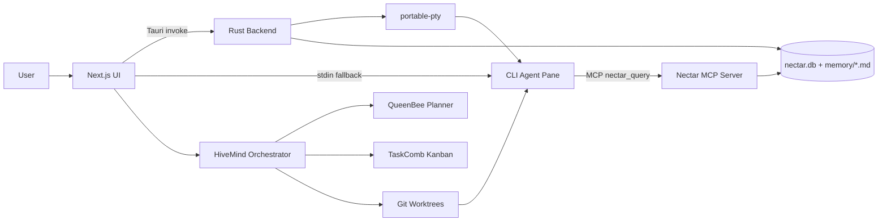
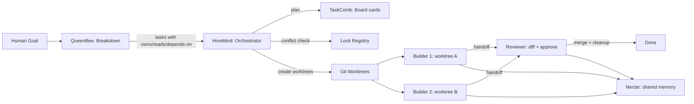
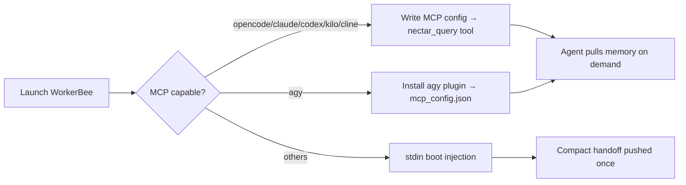
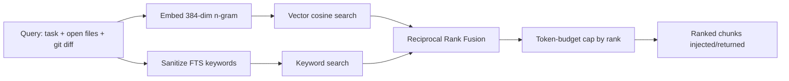

# Hiveory AI v2

> Project intelligence lives in the project, not in a chat session.

Hiveory AI is a local-first, AI-native desktop dev environment. You open a project, run any supported CLI coding agent inside a terminal pane, and every agent automatically reads from and writes to **one shared, project-scoped memory store**. v2 adds **coordination between multiple agents working in parallel** — hand a goal to QueenBee and let a team of agents build it, each in its own isolated worktree, all sharing the same memory.

- **Unified memory (Nectar)** — hybrid vector + keyword search over project knowledge, shared across all agents
- **WorkerBees** — launch CLI coding agents in real terminal panes, wired to memory via MCP or stdin injection
- **Hive shell** — Tauri desktop app with terminal panes, Monaco editor, file explorer, and basic git status/diff
- **Agent orchestration (HiveMind)** — registry, lock management, git worktree isolation, structured handoffs, and a plan/dispatch/approve/review engine
- **Planning (QueenBee)** — breaks a human goal into tasks with declared file ownership and dependencies
- **Kanban board (TaskComb)** — Backlog → Todo → In Progress → Review → Done, drag-to-dispatch triggers HiveMind
- **Workspaces** — multiple saved project contexts as tabs, each with its own pane layout and running agents
- **Model-agnostic** — swap Claude Code → Codex → Aider without losing context
- **Human-readable memory** — `.nectar/memory/*.md` is plain, git-diffable markdown

> **Implementation status (v2):** The shell, terminal panes, Nectar memory (full Rust-backed read/write/search), the TaskComb board UI, and QueenBee conversational modes (Steward/Forager/Stinger) are wired and working.
>
> **QueenBee tool-calling** is implemented ([`Hive/src/lib/queenbeeTools.ts`](Hive/src/lib/queenbeeTools.ts)): QueenBee can perform UI actions conversationally — create workspaces, add/move tasks, launch WorkerBees, toggle the board — via provider tool-calling (Anthropic + OpenAI formats), gated per mode (Steward acts; Forager/Stinger are read-only auditors).
>
> **Orchestration spine:** the git-worktree isolation the Node-only `@hiveory/hivemind` package couldn't provide to the renderer is now backed by Rust Tauri commands (`create_worktree`/`merge_worktree`/`remove_worktree`), and the renderer dispatch service ([`Hive/src/lib/dispatch.ts`](Hive/src/lib/dispatch.ts)) wires `QueenBee.breakdown()` → worktree → WorkerBee launch → board card, reachable through QueenBee's `dispatch_goal` tool after the human approves.
>
> **Verified** by typecheck, unit tests (`queenbeeTools`, `planDispatch`), and `cargo build`. The full GUI flow (real git worktrees + PTY spawn end-to-end) still needs manual verification in a running desktop build — that path can't be exercised headless.

## 📑 Table of Contents

- [🚀 How to Use](#-how-to-use)
- [⚙️ Implementation Process](#️-implementation-process)
- [🧰 Tech Stack](#-tech-stack)
- [📦 Setup & Installation](#-setup--installation)
- [🔌 API Endpoints](#-api-endpoints)
- [🗂️ Project Structure](#️-project-structure)
- [📤 Exports](#-exports)
- [⬇️ Download Release Apps](#️-download-release-apps)
- [📄 License](#-license)

## 🚀 How to Use

**1. Open a project** — Launch Hiveory AI and open any project folder. On open, a `.nectar/` memory store is created (or reused) inside that project.

**2. Pick a mode** — Two modes via the title bar toggle (or Ctrl+`` ` ``):
- **Editor** — file tree + Monaco editor (open/edit/save) with basic git status/diff and an inline terminal.
- **ADE** — WorkerBee pane grid for running CLI agents, with a QueenBee conversational dock on the right, workspaces panel on the left, and a kanban board popup.

**3. Configure providers** — Open Settings (gear icon in title bar) and navigate to the **Providers** section. Connect API providers (Anthropic, OpenAI, Google, DeepSeek, OpenRouter, or custom OpenAI-compatible endpoints). Each provider is verified by calling its models endpoint — invalid keys, unreachable URLs, and model-not-found errors are distinguished. Connected providers populate the **Models** section for app-wide selection.

**4. Launch a WorkerBee** — In ADE mode, open a terminal pane and pick a CLI agent (OpenCode, Claude Code, Codex, Cline, Kilo, Antigravity, or others). It runs as a normal child process you can type into — Hiveory wires project memory in automatically. A `[nectar] memory bridge: ...` line shows which path is active.

**5. Let memory flow** — For MCP-capable agents, a `nectar_query` tool is registered so the agent pulls ranked memory on demand. For others, a compact handoff summary is injected at boot. A visible role badge and branch indicator appears on panes that belong to an active mission.

**6. Coordinate multiple agents (v2)** — Talk to QueenBee in the right-side conversational dock. QueenBee reads Nectar for context, breaks goals into tasks with declared file ownership, and dispatches them autonomously — HiveMind creates isolated git worktrees and launches WorkerBees for each task. Track progress via the Board drawer (button in the ADE toolbar, slides in with a clip-path animation inspired by Orca's `WorkspaceKanbanDrawer`). Cards can be dragged across columns with custom pointer-based drag & drop (threshold-gated at 5px, with floating preview and drop indicator). As Builders finish, cards move to Review where a Reviewer diffs and approves. Every agent reads/writes the same Nectar memory.

**7. Workspaces** — Click the Workspaces button in the ADE toolbar to open the side panel. Create multiple workspaces (each with its own project folder, pane layout, and running agents). Each workspace shows inline agent status badges (launching/running/idle/error/done) and task card counts. Switching workspaces routes the pane grid to that workspace's WorkerBees — agents in non-active workspaces keep running in the background (per-workspace state routing pattern adapted from Orca's `tabsByWorktree` / `layoutByWorktree`).

**8. Swap agents freely** — Close one agent, open another. It picks up decisions, conventions, and handoffs recorded by the previous agent from the same `.nectar/` — no re-explaining.

**9. Inspect & rebuild** — `.nectar/memory/*.md` is readable markdown. Delete `nectar.db` / `.nectar/index/` and re-index — retrieval rebuilds fully from the markdown alone.

## ⚙️ Implementation Process

Hiveory couples a Tauri (Rust) backend with a Next.js frontend. The hard part is **Nectar**: a hybrid-retrieval memory layer shared by every agent.

**High-level architecture**



**v2 Multi-agent orchestration flow**



**Memory bridge selection (per agent)**



**Hybrid retrieval pipeline (the core logic)**



**Key logic & algorithms**
- **Deterministic embeddings** — a 384-dim character n-gram (uni/bi/tri-gram) hash, L2-normalized, so cosine similarity equals dot product. No external model, identical in Rust and JS.
- **Hybrid search** — vector similarity + keyword search always run together; neither alone is trusted.
- **Reciprocal Rank Fusion (RRF)** — merges the two ranked lists with `score = Σ 1/(k + rank)` (k = 60), avoiding score-scale mismatch.
- **sql.js FTS compatibility** — the JS/MCP side builds an FTS4 mirror and ranks via `matchinfo` (the bundled sql.js lacks FTS5/`bm25`); the Rust side uses native FTS5. Both read the same `nectar.db`.
- **Chunk-level indexing** — memory files are chunked by heading/paragraph, embedded, and upserted incrementally; whole files are never injected.
- **Token-budgeted injection** — chunks are truncated by rank to a token budget (~4k default); below a relevance threshold, nothing is injected.
- **Single source of truth** — all retrieval lives in `@hiveory/nectar`; the MCP server imports it rather than reimplementing it.

## 🧰 Tech Stack

| Layer                   | Technology                                                               |
| ----------------------- | ------------------------------------------------------------------------ |
| Desktop Shell           | Tauri v2 (Rust)                                                           |
| Frontend                | Next.js (App Router), React, TailwindCSS                                  |
| Frontend State          | Zustand (persisted settings, workspaces)                                  |
| Terminal                | `xterm.js` + `xterm-addon-webgl` / `-fit` / `-search`                    |
| PTY                     | `portable-pty` (Rust) via Tauri IPC bridge                                |
| Editor                  | Monaco (`@monaco-editor/react`)                                          |
| Storage                 | SQLite — `rusqlite` (Rust) + `sql.js` (Node) → `nectar.db`               |
| Vector Search           | In-DB embeddings + cosine similarity                                      |
| Keyword Search          | SQLite FTS5 (Rust) / FTS4 mirror (Node)                                   |
| Memory Parsing          | `gray-matter` + `remark` / `unified`                                      |
| Agent Bridge            | Model Context Protocol (MCP) stdio server + per-CLI config                |
| Git Worktree Isolation  | Native `git worktree` via child_process                                   |
| Kanban                  | Native React components with custom pointer-based drag & drop (inspired by Orca's `use-workspace-kanban-card-pointer-drag.ts`) |
| Git                     | `simple-git` (basic status/diff)                                          |
| Monorepo                | `pnpm` workspaces + Turborepo                                             |
| Language                | TypeScript, Rust                                                          |

## 📦 Setup & Installation

### Prerequisites

- **Node.js** ≥ 20
- **pnpm** ≥ 9 (`npm i -g pnpm`)
- **Rust** toolchain (stable) + Cargo — https://rustup.rs
- **Tauri v2** system dependencies for your OS — https://tauri.app/start/prerequisites
- At least one **CLI coding agent** installed and on PATH (e.g. `npm i -g @anthropic-ai/claude-code`)

### Install & run (development)

```bash
# 1. Install all workspace dependencies
pnpm install

# 2. Build all packages (Nectar, nectar-mcp, HiveMind, QueenBee, TaskComb, Hive frontend)
pnpm turbo build

# 3. Run the desktop app in dev mode (Rust + Next.js hot reload)
cd Hive
pnpm tauri:dev
```

### Frontend only (Next.js dev server)

```bash
cd Hive
pnpm dev
```

### Standalone package development

```bash
# Nectar memory + hybrid search
cd Nectar
pnpm build
pnpm test

# Nectar MCP server (exposes nectar_query over stdio)
cd Nectar/nectar-mcp
pnpm build

# HiveMind orchestration (v2)
cd HiveMind
pnpm build
pnpm test

# QueenBee planning (v2)
cd QueenBee
pnpm build
pnpm test

# WorkerBees adapters + launcher (standalone)
cd WorkerBees
pnpm build
pnpm test

# TaskComb kanban (v2)
cd TaskComb
pnpm build
pnpm test

# Or build all at once from the root
pnpm turbo build
pnpm turbo test
```

### Build the desktop app (installers)

```bash
cd Hive
pnpm tauri:build
```

### Configuration & keys

Hiveory AI is **local-first — there are no `.env` files to copy.** Provider API keys (Anthropic, OpenAI, Google, OpenRouter, Moonshot) are entered in the in-app **Settings** panel and stored locally via persisted Zustand state; they are passed to each CLI agent's environment at launch.

## 🔌 API Endpoints

Hiveory AI has no HTTP server. The frontend talks to the Rust backend through **Tauri IPC commands** (`invoke(...)`). Core commands:

| Command                          | Purpose                                             |
| -------------------------------- | --------------------------------------------------- |
| `spawn_terminal`                 | Start a PTY-backed agent/terminal in a pane         |
| `write_to_terminal`              | Send input to a running pane                        |
| `read_from_terminal`             | Read pane output                                     |
| `resize_terminal` / `kill_terminal` | Resize / terminate a pane                         |
| `is_process_alive`               | Check whether a pane's process is running           |
| `read_file` / `write_file`       | Filesystem read/write                                |
| `list_directory`                 | File explorer listing                                |
| `git_status`                     | Basic git status/diff                                |
| `ensure_nectar_structure`        | Create the `.nectar/` layout for a project           |
| `nectar_read_memory_file` / `nectar_write_memory_file` | Read/write memory markdown     |
| `nectar_list_memory_files`       | List memory files                                    |
| `nectar_parse_markdown_to_chunks`| Chunk markdown for indexing                          |
| `nectar_index_file`              | Index a memory file (chunk → embed → upsert)         |
| `nectar_search`                  | Hybrid vector + FTS5 search                          |
| `nectar_inject`                  | Assemble ranked, token-capped context                |
| `nectar_format_context`          | Format context for an agent                          |
| `nectar_log_session`             | Log a session to `.nectar/agents/sessions/`          |
| `get_nectar_mcp_path` / `run_command` / `ensure_dir` | MCP server path / helpers        |

The **Nectar MCP server** additionally exposes one agent-facing tool over stdio: `nectar_query` (args: `task`, optional `open_files`, `git_diff`, `max_chunks`).

## 🗂️ Project Structure

```
hiveory/
├── Hive/                         # Tauri desktop app
│   ├── src/                      # Next.js frontend
│   │   ├── app/                  # App Router pages
│   │   ├── components/
│   │   │   ├── editor/           # Monaco editor + file explorer
│   │   │   ├── queenbee/         # QueenBee AgentDock conversational panel
│   │   │   ├── settings/         # Settings page: ProvidersSection + ModelsSection
│   │   │   ├── terminal/         # xterm panes + layout
│   │   │   ├── workerbees/       # CLI agent panes + picker + RoleBadge
│   │   │   └── workspace/        # Workspaces side panel
│   │   ├── stores/               # Zustand stores (settings, workerbees, workspaces, providers)
│   │   └── lib/                  # Nectar client + Tauri helpers
│   └── src-tauri/                # Rust: PTY, filesystem, Nectar IPC, git
│       ├── src/lib.rs
│       ├── icons/
│       └── tauri.conf.json
│
├── HiveMind/                     # Agent orchestration (v2, standalone)
│   ├── src/
│   │   ├── registry/             # Agent registry: track WorkerBees per task
│   │   ├── locks/                # File-ownership lock registry (advisory)
│   │   ├── worktree/             # Git worktree create/remove wrapper
│   │   ├── handoffs/             # Structured handoff files per task
│   │   ├── roles/                # Role definitions (Coordinator/Builder/Scout/Reviewer)
│   │   ├── orchestrator.ts       # Plan/dispatch/approve/reject engine
│   │   └── index.ts              # Public API
│   └── tests/
│
├── QueenBee/                     # AI planning (v2, standalone)
│   ├── src/
│   │   ├── breakdown.ts          # Goal → task list (LLM prompt + template)
│   │   ├── assignment.ts         # Task → role + CLI assignment
│   │   ├── tracking.ts           # Task progress state machine
│   │   ├── review-routing.ts     # Reviewer feedback routing
│   │   └── index.ts
│   └── tests/
│
├── TaskComb/                     # Kanban board (v2, standalone) — includes React components (drawer, lanes, cards, drag & drop)
│   ├── src/
│   │   ├── board.ts              # Column state + card CRUD
│   │   ├── dispatch.ts           # Drag-to-dispatch → HiveMind command
│   │   └── index.ts
│   └── tests/
│
├── Nectar/                       # Unified memory package (standalone)
│   ├── src/
│   │   ├── db/                   # schema, migrations, sql.js access
│   │   ├── memory/               # read/write .nectar/memory/*.md
│   │   ├── search/               # hybrid retrieval (vector + keyword + RRF)
│   │   ├── injection/            # context assembly + token budgeting
│   │   └── index.ts              # public API
│   └── nectar-mcp/               # MCP server (standalone)
│       ├── src/
│       │   ├── server.ts         # stdio MCP server exposing nectar_query
│       │   ├── tools/            # nectar-query tool (imports @hiveory/nectar)
│       │   └── cli-configs/      # per-CLI config builders (one file per CLI)
│       └── package.json
│
├── WorkerBees/                   # CLI agent adapters + launcher (standalone)
│   ├── src/
│   │   ├── adapters/             # Per-CLI adapter implementations (10 agents)
│   │   ├── cli-configs/          # MCP config builders per CLI
│   │   ├── launcher.ts           # WorkerBeeLauncher — Nectar injection + session management
│   │   ├── types.ts              # WorkerBeeAdapter interface + shared types
│   │   └── index.ts
│   └── tests/
│
├── pnpm-workspace.yaml
├── turbo.json
└── package.json
```

## 📤 Exports

**`@hiveory/nectar`** (`Nectar/src/index.ts`)
- `Nectar` — top-level class: `create()`, `search()`, `inject()`, `indexFile()`, `reindexAll()`
- `NectarDatabase` — SQLite access layer
- `MemoryManager` — read/write markdown memory
- `SearchEngine` — `vectorSearch`, `keywordSearch`, `hybridSearch`
- `InjectionPipeline` — query building, ranked assembly, token budgeting

**`@hiveory/nectar-mcp`** (`Nectar/nectar-mcp/src/cli-configs/index.ts`)
- `buildCliConfig(cli, spec, options)` — resolve per-CLI MCP config
- `MCP_CAPABLE_CLIS`, `EXPERIMENTAL_MCP_CLIS`
- Per-CLI builders: `opencodeConfig`, `claudeCodeConfig`, `codexConfig`, `kiloCodeConfig`, `clineConfig`, `antigravityConfig`
- `NECTAR_QUERY_TOOL`, `runNectarQuery(projectPath, args)` (from `tools/nectar-query`)

**`@hiveory/hivemind`** (`HiveMind/src/index.ts`) — v2
- `HiveMind` — top-level class: `create()`, plan/dispatch/complete/approve/reject
- `AgentRegistry` — track WorkerBees, status lifecycle, mission queries
- `LockRegistry` — advisory file-ownership conflict detection
- `WorktreeManager` — `git worktree add/remove/merge-and-remove` wrapper
- `HandoffManager` — read/write `.nectar/agents/handoffs/<task>.md`
- `RoleManager` — four fixed roles: Coordinator, Builder, Scout, Reviewer
- `Orchestrator` — `plan()`, `dispatch()`, `complete()`, `approve()`, `reject()`

**`@hiveory/queenbee`** (`QueenBee/src/index.ts`) — v2
- `breakdown()` / `templateBreakdown()` — goal → task list with owns/reads/depends-on
- `buildBreakdownPrompt()` — LLM prompt template for Nectar-aware breakdown
- `DefaultAssignmentStrategy` — task → role + CLI assignment
- `ProgressTracker` — task status lifecycle (backlog → done)
- `ReviewRouter` — approval/rejection routing (reassign/retry/complete)
- `MODE_SYSTEM_PROMPTS` / `detectModeIntent()` / `MODE_LABELS` — Steward/Forager/Stinger mode prompts + intent routing (single-sourced here; the Hive chat imports them rather than re-declaring)

**`@hiveory/taskcomb`** (`TaskComb/src/index.ts`) — v2
- `Board` — kanban state: `addCard()`, `moveCard()`, `getCardsByColumn()`
- `DefaultDispatchResolver` — resolve project path, CLI, worktree dir from a card
- `buildDispatchCommand()` — produce the HiveMind dispatch command for a card

**`@hiveory/worker-bees`** (`WorkerBees/src/index.ts`) — restored standalone package
- `WorkerBeeLauncher` — `launch()`, `endSession()`, `getActiveSessions()`
- `WorkerBeeAdapter` — adapter interface for per-CLI logic (`getCommand`, `onSessionEnd`, `formatContext`)
- 10 adapters: `OpenCodeAdapter`, `ClaudeCodeAdapter`, `CodexAdapter`, `KiloAdapter`, `ClineAdapter`, `AntigravityAdapter`, `AiderAdapter`, `KimiCodeAdapter`, `CursorAdapter`, `KiroAdapter`
- `buildCliConfig(cli, spec, options)` — resolve per-CLI MCP config (re-exported from `cli-configs/`)

## ⬇️ Download Release Apps

Prebuilt Windows installers (x64) are produced by `pnpm tauri:build` at
`Hive/src-tauri/target/release/bundle/`:

| Installer                              | Type          | Size    |
| -------------------------------------- | ------------- | ------- |
| `Hiveory AI_0.1.0_x64-setup.exe`       | NSIS setup    | ~66 MB  |
| `Hiveory AI_0.1.0_x64_en-US.msi`       | MSI installer | ~68 MB  |

A standalone executable is also available at
`Hive/src-tauri/target/release/hiveory-ai.exe`.

## 📄 Reference

A detailed feature mapping between **Hiveory v2** and **Orca** (Stably AI's parallel-agent IDE) lives in [`SIMILAR.md`](./SIMILAR.md). It documents Orca's implementations for workspaces, git worktree isolation, kanban board UI/UX, drag-and-drop mechanics, and session persistence — along with which patterns apply to Hiveory and which are out of scope.

### ADE Redesign Pass (Orca-inspired)

The following changes were made during the ADE UI/UX redesign pass, using Orca as a visual and interaction reference:

| Change | Orca source | Files affected |
|---|---|---|
| Kanban board replaced with slide-out drawer using `clip-path` animation | `WorkspaceKanbanDrawer.tsx`, `main.css:1614` | New in `TaskComb/src/components/`: `TaskCombDrawer.tsx`, `TaskCombLaneGrid.tsx`, `TaskCombStatusLane.tsx`, `TaskCombCard.tsx`, `TaskCombDrawerHeader.tsx` (renamed from Orca's `WorkspaceKanban*` to Hiveory vocab) |
| Custom pointer-based drag & drop (threshold-gated, floating preview, drop indicator) | `use-workspace-kanban-card-pointer-drag.ts` | New in `TaskComb/src/components/`: `use-workspace-kanban-card-pointer-drag.ts` |
| Multi-selection (click/shift/cmd) | `use-workspace-kanban-selection.ts` | New in `TaskComb/src/components/`: `use-workspace-kanban-selection.ts` |
| Column resize (pointer + keyboard) | `use-workspace-kanban-column-resize.ts` | New in `TaskComb/src/components/`: `use-workspace-kanban-column-resize.ts` |
| Board open/close/drag-preview state machine | `useWorkspaceBoardPanel.ts` | New in `TaskComb/src/components/`: `useTaskCombBoardPanel.ts` |
| Toolbar pulse animation during drag preview | `main.css:1649` | `Hive/src/app/globals.css` |
| Workspace panel: agent status badges per workspace | `WorktreeCardAgents.tsx` | `Hive/src/components/workspace/WorkspacesPanel.tsx` (redesigned) |
| Per-workspace WorkerBee state routing (switch workspace → switch grid) | `setActiveWorktree`, `tabsByWorktree` pattern | `Hive/src/components/workerbees/WorkerBeesPanel.tsx`, `Hive/src/app/HomePage.tsx`, `Hive/src/stores/workspaceStore.ts`, `Hive/src/stores/workerBeesStore.ts` |
| Task card data model enriched with `sortOrder`, `owns`, `reads`, `dependsOn`, `blockingReason` | `TaskCard` type adapted from Orca's workspace-status model per AGENTS1.md §3.2 | `TaskComb/src/board.ts` (canonical type), `Hive/src/stores/workspaceStore.ts` (imports from `@hiveory/taskcomb`) |
| Left sidebar: Workspace-grouped worktree rows with live-status dot, primary badge, subtitle, search + filter, resizable (min 220px / max 500px) | `WorktreeCard.tsx`, `WorktreeCardStatusSlot.tsx`, `StatusIndicator.tsx`, `SidebarFilter.tsx`, `useSidebarResize` (min 220 / max 500) | New `Hive/src/components/ade/ADEWorktreeSidebar.tsx` |
| Right panel: Agent Session History with scope tabs ("This worktree" / "This workspace" / "All"), search, collapsible agent-type group headers, session cards with branch chip and relative timestamp | `AiVaultPanel.tsx`, `AiVaultPanelHeader.tsx`, `AiVaultPanelControls.tsx` (VaultScopeSwitch, VaultGroupHeader), `AiVaultSessionRow.tsx`, `AiVaultSessionVirtualList.tsx` | New `Hive/src/components/ade/ADESessionHistory.tsx` |
| Backend: `nectar_list_sessions` Tauri IPC command — reads `.nectar/agents/sessions/*.md`, parses frontmatter, returns sorted/filtered session entries | Orca's `ai-vault-types.ts` (AiVaultSession, AiVaultListArgs/Result) adapted for Nectar's file-based model per AGENTS.md §3 (no AI Vault scanners) | `Hive/src-tauri/src/lib.rs` (new `nectar_list_sessions` command, extended `NectarLogSessionRequest` with `title`/`branch`/`worktree_id`/`message_count`), `Hive/src/lib/nectar.ts` (new `listSessions()` method, `NectarSessionEntry` type) |
| Left sidebar flattened: one flat row per workspace (no group/child nesting), inline rename, branch label, agent/task counts | Orca's flat `WorktreeList` — no nesting per AGENTS.md §3.1 (workspace = worktree 1:1) | `Hive/src/components/ade/ADEWorktreeSidebar.tsx` (rewritten) |
| "Workspaces" tab removed from center toolbar; Board moved to toolbar toggle button (drawer, not tab) | Orca's `useWorkspaceBoardPanel` state machine + `WorkspaceKanbanDrawer` as slide-out overlay | `Hive/src/components/workerbees/WorkerBeesPanel.tsx` (rewritten toolbar) |
| QueenBee + Sessions merged into single right dock with Chat/History sub-tabs | Orca's `right-sidebar/index.tsx` with activity-bar sub-tabs (workspace-level vault/agents toggles) | New `Hive/src/components/ade/ADERightDock.tsx` |
| Session scope reduced from 3 to 2 tabs ("This workspace" / "All") — "This worktree" removed as redundant with §0's 1:1 model | Per AGENTS.md §3.1: workspace = worktree, so separate scopes collapsed | `Hive/src/components/ade/ADESessionHistory.tsx` (redesigned scope tabs) |

## 📄 License

Open-source (license TBD).
