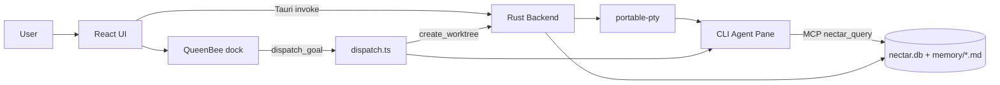

# Hiveory AI

> Project intelligence lives in the project, not in a chat session.

A local-first, AI-native desktop dev environment. Open a project, run any CLI coding agent in a terminal pane, and every agent reads from and writes to **one shared, project-scoped memory store**. Hand a goal to QueenBee and a team of agents builds it in parallel — each in its own git worktree, all sharing the same memory.

## Features

- **Unified memory (Nectar)** — hybrid vector + keyword search over project knowledge, shared by all agents. Stored as plain, git-diffable `.nectar/memory/*.md`.
- **WorkerBees** — launch CLI agents (Claude Code, Codex, OpenCode, Aider, Cline, Kilo, Antigravity, and more) in real terminal panes, wired to memory via MCP or stdin injection.
- **QueenBee** — conversational planner (Steward / Forager / Stinger modes) that breaks a goal into tasks with declared file ownership and acts on the app via tool-calling.
- **Multi-agent orchestration** — dispatch a goal to isolated git worktrees, one WorkerBee per task, tracked on the Task Comb board.
- **Task Comb** — pipeline/board view of a mission's stages.
- **Workspaces** — multiple saved project contexts as tabs, each with its own pane layout and running agents.
- **Model-agnostic** — swap agents without losing context.

## How it works

Tauri (Rust) backend + Vite/React frontend. The core is **Nectar**, a hybrid-retrieval memory layer shared by every agent.



**Retrieval:** query (task + open files + git diff) is embedded as a 384-dim character n-gram hash (deterministic, identical in Rust and JS — no external model) and keyword-sanitized. Vector cosine and keyword (FTS5 in Rust / FTS4 in Node) searches run together, merged via Reciprocal Rank Fusion (`k=60`), then capped to a token budget by rank. Memory is chunked by heading/paragraph; whole files are never injected. All retrieval lives in `@hiveory/nectar`; the MCP server imports it.

**Memory bridge per agent:** MCP-capable agents get a `nectar_query` tool registered; others receive a compact handoff summary injected at boot.

## Tech Stack

| Layer | Technology |
| --- | --- |
| Desktop shell | Tauri v2 (Rust) |
| Frontend | Vite + React, TailwindCSS, Zustand |
| Terminal | `xterm.js` (+ webgl/fit/search) over `portable-pty` |
| Storage | SQLite — `rusqlite` (Rust) + `sql.js` (Node) → `nectar.db` |
| Search | In-DB vector cosine + SQLite FTS5/FTS4, fused with RRF |
| Agent bridge | Model Context Protocol (MCP) stdio server |
| Worktrees | `git worktree` via Rust Tauri commands |
| Monorepo | `pnpm` workspaces + Turborepo, TypeScript + Rust |
| Tests | Vitest (per package) |

## Getting Started

**Prerequisites:** Node ≥ 20, pnpm ≥ 9, Rust (stable) + Cargo, [Tauri v2 system deps](https://tauri.app/start/prerequisites), and at least one CLI agent on PATH.

```bash
pnpm install
pnpm turbo build
cd Hive && pnpm tauri:dev     # run the desktop app (Rust + frontend hot reload)
```

- Frontend only: `cd Hive && pnpm dev`
- Build installers: `cd Hive && pnpm tauri:build` → `Hive/src-tauri/target/release/bundle/` (NSIS `.exe`, MSI)
- Per-package: `pnpm build && pnpm test` in any package, or `pnpm turbo build|test` from root

**Keys:** local-first, no `.env`. Provider keys (Anthropic, OpenAI, Google, OpenRouter, Moonshot, …) are entered in the in-app Settings panel, stored via persisted Zustand, and passed to each agent's environment at launch.

## Packages

| Package | Purpose |
| --- | --- |
| `Hive` | Tauri desktop app — UI shell + Rust backend (PTY, filesystem, git/worktree, Nectar IPC) |
| `Nectar` | Unified memory: DB, markdown read/write, hybrid retrieval, injection |
| `Nectar/nectar-mcp` | MCP stdio server exposing `nectar_query` + per-CLI config builders |
| `QueenBee` | Planning: goal → task breakdown, role/CLI assignment, progress + review routing, mode prompts |
| `TaskComb` | Board/pipeline state + React UI |
| `WorkerBees` | Per-CLI adapters + launcher (Nectar injection, session management) |
| `HiveMind` | Orchestration engine: registry, file-ownership locks, roles, worktrees, handoffs, plan/dispatch/approve |

## Tauri IPC

No HTTP server — the frontend calls Rust via `invoke(...)`. Command groups:

- **Panes:** `spawn_terminal`, `write_to_terminal`, `read_from_terminal`, `resize_terminal`, `kill_terminal`, `is_process_alive`
- **Files/git:** `read_file`, `write_file`, `list_directory`, `git_status`
- **Worktrees:** `create_worktree`, `merge_worktree`, `remove_worktree`
- **Nectar:** `ensure_nectar_structure`, `nectar_read_memory_file`, `nectar_write_memory_file`, `nectar_list_memory_files`, `nectar_index_file`, `nectar_search`, `nectar_inject`, `nectar_log_session`, `get_nectar_mcp_path`

The MCP server exposes one agent-facing tool: `nectar_query` (`task`, optional `open_files`, `git_diff`, `max_chunks`).

## Architecture rule

Each root folder is a standalone package that owns its domain. **Hive borrows; it
never re-implements.** Orchestration policy lives in HiveMind, planning in
QueenBee, retrieval in Nectar, board state in TaskComb.

Side effects are the one thing packages can't do portably — the renderer has no
`node:child_process`/`node:fs`. So HiveMind defines **ports** (`WorktreeOps`,
`HandoffFs`) and ships Node implementations for CLI use; Hive injects
Tauri-backed adapters ([`hivemindAdapters.ts`](Hive/src/lib/hivemindAdapters.ts)).
Import `@hiveory/hivemind/core` for the pure engine, or the package root for
core + Node implementations. A test enforces that the core stays free of `node:`
imports.

## Status

Working: shell, terminal panes, Nectar memory (Rust-backed read/write/search),
Task Comb (pipeline/progress/tasks/history), QueenBee modes + tool-calling, and
dispatch driven by **HiveMind's Orchestrator** — lock-conflict checks, git
worktree per builder, handoff files, and agent registry. Explorer/Search/Git are
functional with a read-only file/diff viewer. A CDP browser pane gives localhost
preview and screenshots QueenBee can read.

Verified by unit tests across all packages (`pnpm turbo test`), `tsc --noEmit`,
and `cargo build`. **Not verified by running the desktop app** — the GUI flow
(real worktree, PTY spawn, CDP screencast, branch merge) can't be exercised
headless and needs a manual pass with `pnpm tauri:dev`.

Not yet wired: the Reviewer loop (`approve`/`reject` exist in HiveMind and merge
via `merge_worktree`, but no reviewer UI drives them), and `Board`/TaskComb card
state is not yet the same store the Orchestrator registry uses.

## License

Personal, non-commercial use only — see [LICENSE](LICENSE). Commercial use is not
permitted; contact raktimyoddha07@gmail.com for a commercial license.
