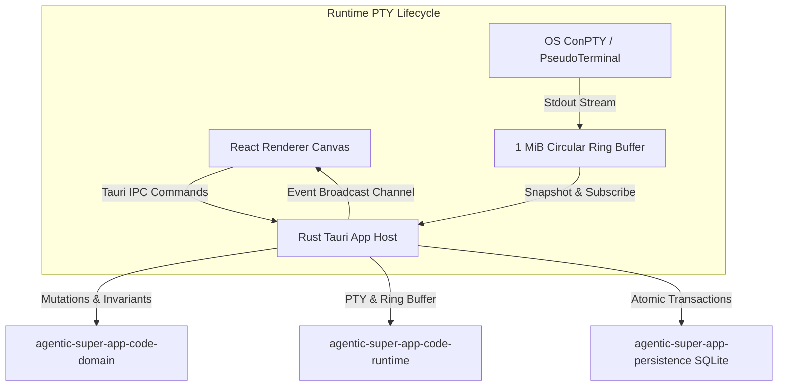

# Terminal-First Multipane Code Workspace Architecture

## 1. Overview

The Code Workspace delivers a native, host-authoritative terminal-first multipane canvas. The architecture separates topology mutations, PTY session lifecycle, and renderer projection into distinct layers with strict optimistic concurrency.



---

## 2. Host-Authoritative Topology & Layout Schema v2

`CodePaneLayout` defines the binary tree structure stored atomically in SQLite:

- `root_id: String`: The root node ID in the graph.
- `nodes: Vec<CodePaneNode>`: Flat list of all nodes in the tree.
- `revision: u64`: Monotonically increasing revision number for optimistic concurrency.
- `focused_pane_id: Option<String>`: Persisted focused leaf ID.
- `maximized_pane_id: Option<String>`: Active maximized leaf ID.

### Node Structure

```rust
pub struct CodePaneNode {
    pub pane_id: String,
    pub parent_id: Option<String>,
    pub kind: CodePaneKind, // Terminal | CodingAgent | Editor | Diff | Preview | Problems | Empty | Thread
    pub orientation: Option<CodePaneOrientation>, // Horizontal | Vertical (internal nodes only)
    pub ratio_percent: Option<u8>, // 10..=90
    pub children: Vec<String>, // Leaf: [], Internal: [child_1, child_2]
    pub resource_id: Option<String>, // Bound terminal ID, preview ID, or thread ID
    pub title: Option<String>, // User-visible title
}
```

### Optimistic Concurrency Control

All layout mutations (`Split`, `Rename`, `Move`, `Resize`, `Focus`, `Maximize`, `ApplyPreset`) require `expected_revision`.
The host applies:
```sql
UPDATE agentic_super_app_code_layouts
SET layout_json = ?, revision = revision + 1, updated_at_unix_ms = ?
WHERE workspace_id = ? AND revision = ?;
```
If another process or window mutated the tree concurrently, an `ApiError` with code `layout_conflict` is returned, causing the renderer to reload and reconcile cleanly.

---

## 3. Deterministic Layout Engine & 17-Pane Scaling

The code workspace supports up to **17 panes** (`CODE_MAX_PANES = 17`). Attempting to split when 17 panes are already active returns `CodeDomainError::TooManyPanes`.

### Canonical Layout Presets & Capacity Rules

| Preset | Identifiers | Maximum Panes | Arrangement Rule |
|---|---|---:|---|
| **Vertical** | `vertical`, `equal_columns` | 4 | Equal side-by-side columns separated by vertical dividers. |
| **Horizontal** | `horizontal`, `equal_rows` | 4 | Equal stacked rows separated by horizontal dividers. |
| **2 Rows** | `two_rows` | 8 | Up to four columns, with no column containing more than two rows. Columns filled evenly with remainder in rightmost column (e.g. 5 panes -> `[2, 2, 1]`). |
| **3 Rows** | `three_rows` | 12 | Up to four columns, with no column containing more than three rows. Remainder in rightmost column (e.g. 5 panes -> `[3, 2]`). |
| **4 Rows** | `four_rows`, `grid` | 16 | Up to four columns, with no column containing more than four rows. Remainder in rightmost column (e.g. 5 panes -> `[4, 1]`, 16 panes -> `[4, 4, 4, 4]`). |
| **Focus** | `focus`, `main_left`, `tidy` | 17 | Focused pane occupies 60% of canvas width (left). Supporting panes $S = N - 1$ ($1 \le S \le 16$): 1–4 panes in single right column; 5–16 panes split horizontally into 2 equal right columns with $\lfloor S/2 \rfloor$ and $\lceil S/2 \rceil$ panes (e.g. 6 panes -> `[2, 3]`, 17 panes -> `[8, 8]`). |

### Capacity Guard & Error Protocol

When an operation attempts to apply a preset to more panes than supported, the domain returns:
```rust
CodeDomainError::PresetCapacityExceeded {
    preset: String,
    count: usize,
    max: usize,
}
```
In the UI, incompatible preset cards are visually muted, marked with `aria-disabled="true"`, ignore click/drop gestures, and display a helpful tooltip explaining capacity limits.

---

## 4. Reconnectable PTY Runtime & Ring Buffer

Each terminal session (`TerminalSession`) is owned in-memory by `agentic-super-app-code-runtime`:

- **Circular Ring Buffer:** A bounded `VecDeque<u8>` preserving the most recent 1 MiB of terminal output.
- **Sequence Counter:** Atomic monotonically increasing sequence counter incremented on each chunk.
- **Broadcast Channel:** `tokio::sync::broadcast` emitting live `CodeTerminalEvent`s to subscribers.
- **Snapshot Query:** `agentic_super_app_query_code_terminal_snapshot` fetches the full 1 MiB backlog and latest sequence number on mount or remount.
- **Event Streaming:** `agentic_super_app_stream_code_terminal_events` streams live chunks emitted after the snapshot sequence.

---

## 5. Safe Process Lifecycle & Close Protocol

Closing a pane follows a strict safety protocol:
1. If the pane is an `Empty`, `Editor`, `Diff`, `Problems`, `Preview`, or `Thread` pane, the leaf is removed and the tree collapsed immediately.
2. If the pane contains an active `Terminal` or `CodingAgent` with state `Running` or `Starting`, closing without `terminate_running_resource = true` returns an application error `resource_running`.
3. When the user confirms termination, the host:
   - Force-terminates the exact OS process tree through `StopCodeTerminal`.
   - Records the state transition to `Interrupted` in persistence.
   - Collapses the binary split tree and commits the new revision.
