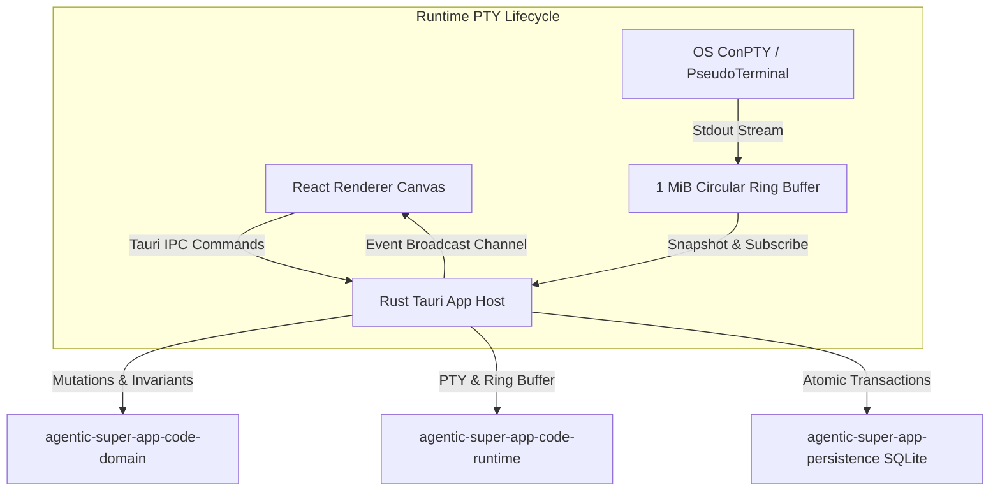

# Terminal-First Multipane Code Workspace Architecture

## 1. Overview

The Code Workspace delivers a native, host-authoritative terminal-first multipane canvas. The architecture separates topology mutations, PTY session lifecycle, and renderer projection into distinct layers with strict optimistic concurrency.



---

## 2. Host-Authoritative Topology & Layout Schema v2

`CodePaneLayout` defines the binary tree structure stored atomically in SQLite:

- `root_id: String`: The root node ID in the graph.
- `nodes: Vec<CodePaneNode>`: Flat list of all nodes in the tree.
- `revision: u64`: Monotonically increasing revision number for optimistic concurrency.
- `focused_pane_id: Option<String>`: Persisted focused leaf ID.
- `maximized_pane_id: Option<String>`: Active maximized leaf ID.

### Node Structure

```rust
pub struct CodePaneNode {
    pub pane_id: String,
    pub parent_id: Option<String>,
    pub kind: CodePaneKind, // Terminal | CodingAgent | Preview | Thread | Empty
    pub orientation: Option<CodePaneOrientation>, // Horizontal | Vertical (internal nodes only)
    pub ratio_percent: Option<u8>, // 10..=90
    pub children: Vec<String>, // Leaf: [], Internal: [child_1, child_2]
    pub resource_id: Option<String>, // Bound terminal ID, preview ID, or thread ID
    pub title: Option<String>, // User-visible title
}
```

### Optimistic Concurrency Control

All layout mutations (`Split`, `Rename`, `Move`, `Resize`, `Focus`, `Maximize`, `ApplyPreset`) require `expected_revision`.
The host applies:
```sql
UPDATE agentic_super_app_code_layouts
SET layout_json = ?, revision = revision + 1, updated_at_unix_ms = ?
WHERE workspace_id = ? AND revision = ?;
```
If another process or window mutated the tree concurrently, an `ApiError` with code `layout_conflict` is returned, causing the renderer to reload and reconcile cleanly.

---

## 3. Reconnectable PTY Runtime & Ring Buffer

Each terminal session (`TerminalSession`) is owned in-memory by `agentic-super-app-code-runtime`:

- **Circular Ring Buffer:** A bounded `VecDeque<u8>` preserving the most recent 1 MiB of terminal output.
- **Sequence Counter:** Atomic monotonically increasing sequence counter incremented on each chunk.
- **Broadcast Channel:** `tokio::sync::broadcast` emitting live `CodeTerminalEvent`s to subscribers.
- **Snapshot Query:** `agentic_super_app_query_code_terminal_snapshot` fetches the full 1 MiB backlog and latest sequence number on mount or remount.
- **Event Streaming:** `agentic_super_app_stream_code_terminal_events` streams live chunks emitted after the snapshot sequence.

---

## 4. Safe Process Lifecycle & Close Protocol

Closing a pane follows a strict safety protocol:
1. If the pane is an `Empty`, `Preview`, or `Thread` pane, the leaf is removed and the tree collapsed immediately.
2. If the pane contains an active `Terminal` or `CodingAgent` with state `Running` or `Starting`, closing without `terminate_running_resource = true` returns an application error `resource_running`.
3. When the user confirms termination, the host:
   - Force-terminates the exact OS process tree through `StopCodeTerminal`.
   - Records the state transition to `Interrupted` in persistence.
   - Collapses the binary split tree and commits the new revision.
